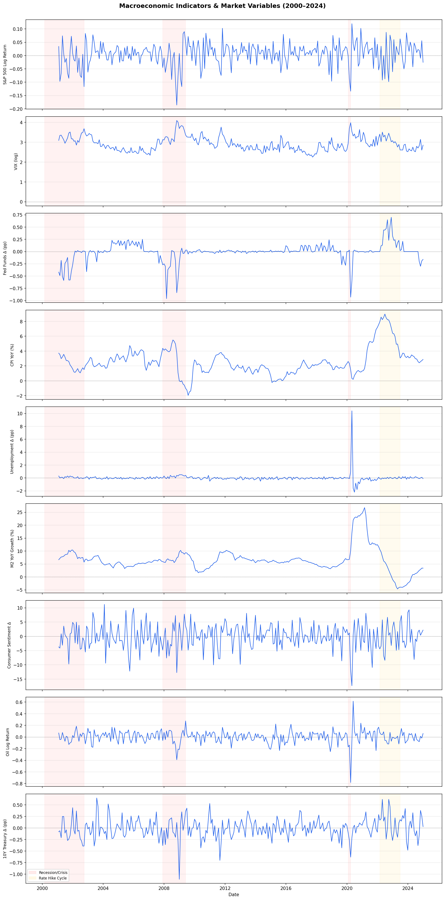
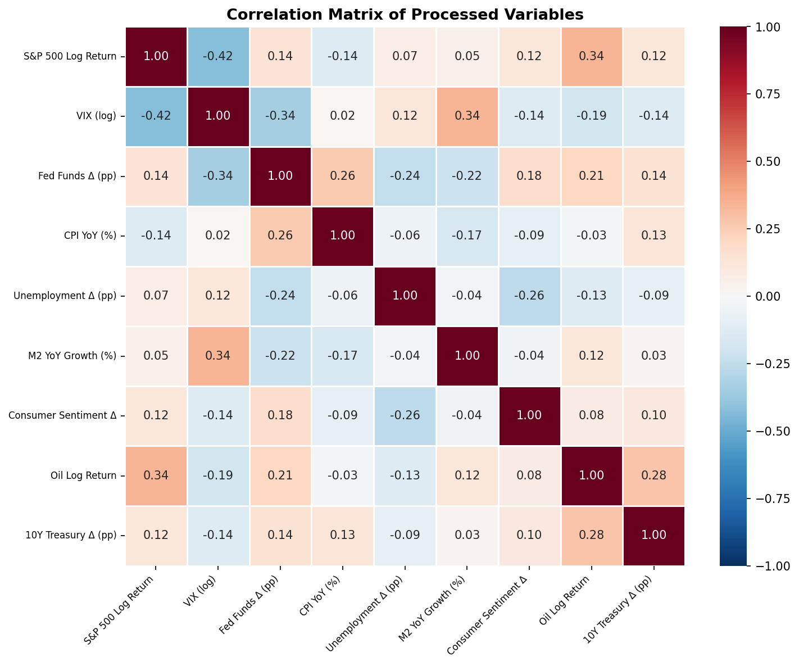
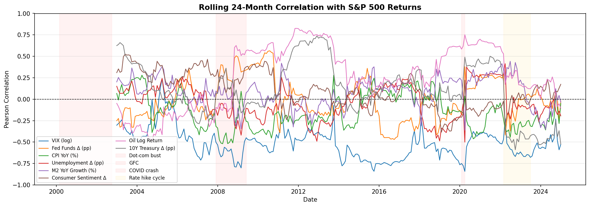
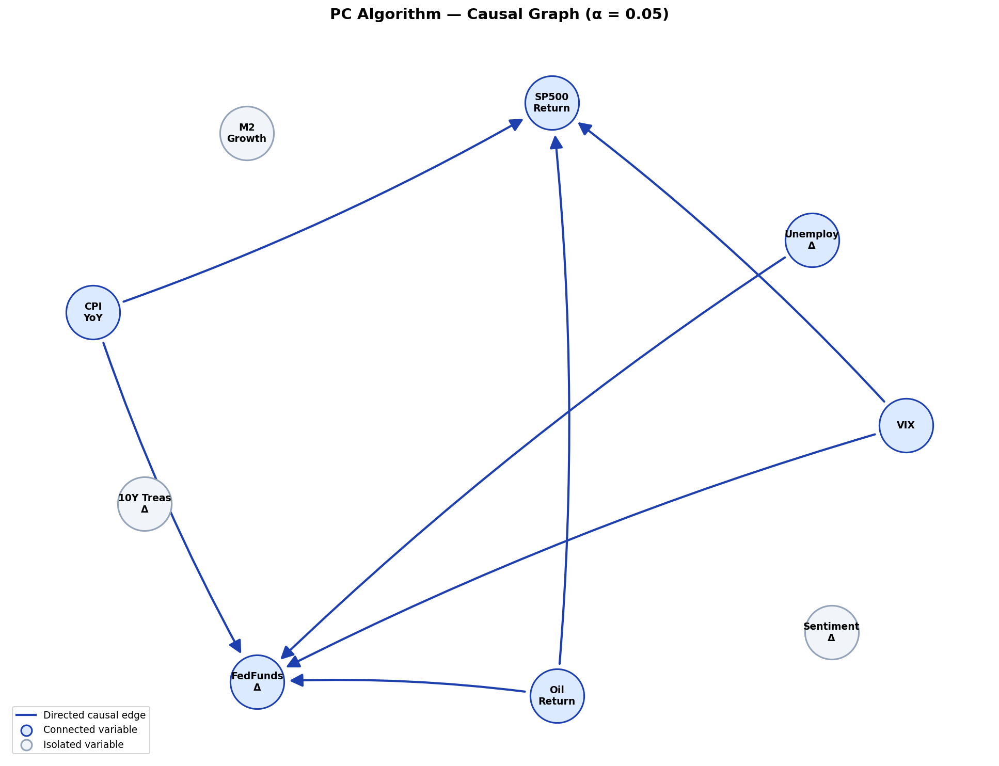
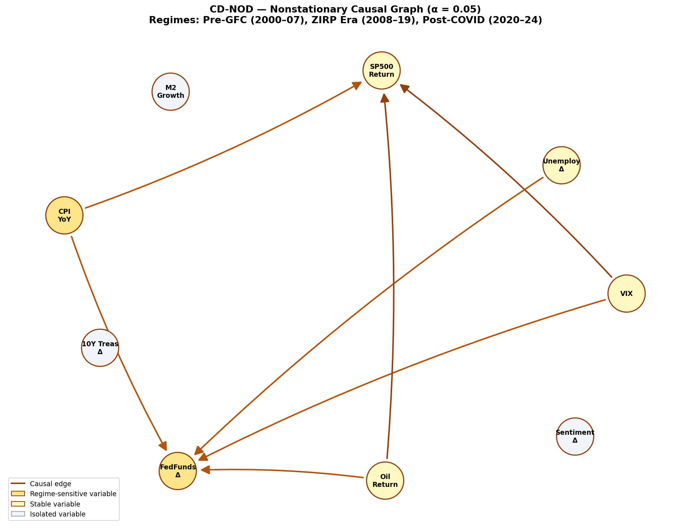
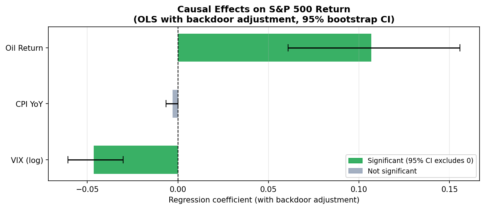
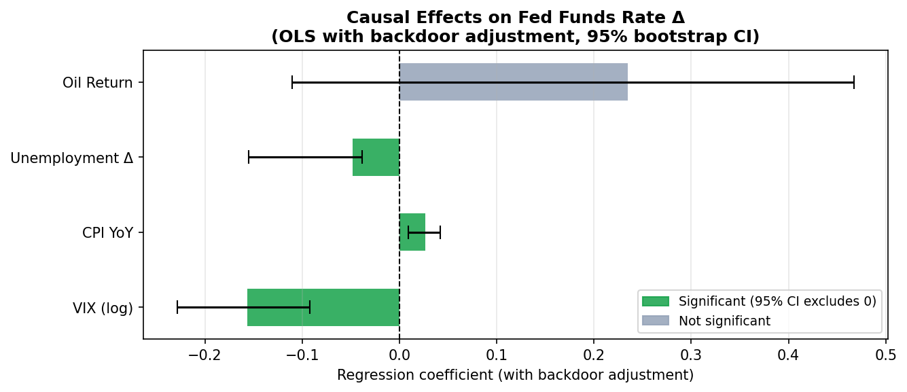

# DSC 245 Project — Section 2.1: Macroeconomic Indicators & Stock Market
## Analysis Summary

---

## 1. Data

We collected **288 months of data (January 2001 – December 2024)** from two sources:

- **Yahoo Finance**: S&P 500 (`^GSPC`), VIX (`^VIX`)
- **FRED**: Federal Funds Rate (`FEDFUNDS`), CPI (`CPIAUCSL`), Unemployment Rate (`UNRATE`), M2 Money Supply (`M2SL`), Consumer Sentiment (`UMCSENT`), WTI Oil Price (`DCOILWTICO`), 10-Year Treasury Yield (`GS10`)

All variables were transformed to ensure stationarity before any modeling:

| Variable | Transformation | Rationale |
|---|---|---|
| S&P 500 | Monthly log return | Price level is non-stationary |
| VIX | Log level | Already mean-reverting |
| Fed Funds Rate | First difference (MoM) | Level is non-stationary |
| CPI | Year-over-year % change | Captures inflation rate |
| Unemployment | First difference (MoM) | Level is non-stationary |
| M2 | Year-over-year % change | Captures growth rate |
| Consumer Sentiment | First difference (MoM) | Level is non-stationary |
| Oil | Monthly log return | Price level is non-stationary |
| 10Y Treasury | First difference (MoM) | Level is non-stationary |

All 9 transformed variables passed the **ADF stationarity test** at α = 0.05 (CPI YoY p = 0.043, all others p < 0.01).

---

## 2. Exploratory Analysis

### Time Series

The time series plot (Figure 1) highlights three key economic episodes:
- **2008–2009 GFC**: Fed Funds Rate dropped nearly 1pp in a single month; unemployment spiked
- **2020 COVID**: Unprecedented M2 growth (~25% YoY); unemployment shock of +9pp in one month
- **2022–2023 Rate Hike Cycle**: CPI peaked at ~9% YoY; Fed raised rates by up to 0.75pp/month

### Correlation Matrix

Key pairwise correlations with S&P 500 return (Figure 2):
- **VIX: −0.42** — strongest negative correlation, as expected (fear index)
- **Oil Return: +0.34** — positive co-movement
- **Fed Funds Δ: +0.14** — weak linear relationship

Notably, most correlations are modest, suggesting that simple linear relationships are insufficient to capture the dynamics — motivating our causal approach.

### Rolling Correlation

The 24-month rolling correlation plot (Figure 3) reveals substantial time-variation in all relationships. For example:
- VIX–SP500 correlation ranges from −0.9 to near 0 across the sample
- Oil–SP500 correlation surged to +0.8 during 2008–2012, then reverted

**This instability directly motivates the use of CD-NOD** to test for structural changes in causal mechanisms.

---

## 3. Methods

We applied three causal analysis methods in sequence, each addressing a different aspect of the research question.

### 3.1 Granger Causality

Granger causality tests whether past values of variable X help predict variable Y beyond Y's own history. We used a VAR model with AIC-selected lag of 2 months.

**Results — X → S&P 500 Return:**

| Variable | F-stat | p-value | Significant? |
|---|---|---|---|
| CPI YoY | 3.698 | 0.026 | ✅ Yes |
| Fed Funds Δ | 1.417 | 0.244 | No |
| Oil Return | 1.250 | 0.288 | No |
| VIX | 0.077 | 0.926 | No |
| Unemployment Δ | 0.087 | 0.917 | No |
| M2 Growth | 0.285 | 0.752 | No |
| Consumer Sentiment Δ | 0.298 | 0.743 | No |
| 10Y Treasury Δ | 0.471 | 0.625 | No |

Only CPI significantly Granger-causes S&P 500 returns at lag 2. This is consistent with market efficiency — most macroeconomic information is priced in quickly, except for inflation data which markets process more slowly.

The **pairwise Granger matrix** revealed richer dynamics among macro variables themselves: S&P 500 Granger-causes Fed Funds (p = 0.02), suggesting the Fed reacts to market conditions; Oil Granger-causes CPI (p < 0.01) and unemployment; 10Y Treasury Granger-causes Fed Funds (p < 0.01).

### 3.2 PC Algorithm

The PC algorithm discovers causal structure from conditional independence tests (Fisher Z, α = 0.05), using all 288 months of data.

**Discovered edges (Figure 4):**

```
VIX          → SP500 Return
CPI YoY      → SP500 Return
Oil Return   → SP500 Return
VIX          → FedFunds Δ
CPI YoY      → FedFunds Δ
Unemployment Δ → FedFunds Δ
Oil Return   → FedFunds Δ
```

**Isolated nodes** (no significant conditional dependence with others): M2 Growth, Consumer Sentiment Δ, 10Y Treasury Δ.

Key observations:
- VIX and Oil Return have direct causal effects on SP500, which Granger causality missed — demonstrating that PC captures **conditional** relationships that simple bivariate tests cannot
- The Fed Funds rate is causally influenced by four variables (VIX, CPI, Unemployment, Oil), consistent with the Fed's dual mandate and commodity price sensitivity
- CPI → SP500 is present in both Granger and PC; all other SP500 edges are unique to PC

### 3.3 CD-NOD (Nonstationary Causal Discovery)

CD-NOD (Huang et al., 2020) extends PC to detect whether causal mechanisms change over time. We used a **continuous time index** (0 to 287) as the domain-change indicator, allowing the algorithm to detect smooth structural shifts rather than imposing discrete regime boundaries.

**Results:**
- The overall causal graph structure is **identical to PC** (same 7 edges)
- **Two variables are regime-sensitive**: **CPI YoY** and **Fed Funds Δ** — their causal mechanisms changed significantly across the sample period

This finding is economically meaningful:
- **CPI's mechanism changed** because the inflation environment was fundamentally different across three eras: moderate pre-GFC inflation (2000–07), near-zero post-GFC inflation during ZIRP (2008–19), and the post-COVID inflation surge (2020–24)
- **Fed Funds' mechanism changed** because the Fed's reaction function shifted: pre-GFC conventional monetary policy, post-GFC unconventional policy (QE, zero lower bound), and post-COVID aggressive tightening

The structural stability of the other 7 variables suggests the **core causal architecture of the macro-financial system is robust**, even as the strength of specific channels (particularly inflation transmission) varies across regimes.

---

## 4. Causal Effect Estimation

Using the PC-discovered graph and the **backdoor criterion**, we estimated the causal effect of each variable on its downstream targets via OLS regression with 1,000-iteration bootstrap confidence intervals.

### Effects on S&P 500 Return (Figure 5)

| Cause | Coefficient | 95% CI | Significant? |
|---|---|---|---|
| VIX (log) | −0.047 | [−0.061, −0.030] | ✅ Yes |
| Oil Return | +0.107 | [+0.061, +0.156] | ✅ Yes |
| CPI YoY | −0.003 | [−0.007, +0.000] | No |

- **VIX**: A 1-unit increase in log VIX causes a −4.7pp decrease in monthly S&P 500 return, after controlling for CPI and Oil
- **Oil Return**: A 1pp increase in oil monthly return causes a +0.11pp increase in S&P 500 return, controlling for VIX and CPI
- **CPI YoY**: After controlling for VIX and Oil, CPI's direct effect on SP500 is near zero and not significant — suggesting CPI affects the stock market **indirectly** through the Fed Funds channel, not directly

### Effects on Fed Funds Rate Δ (Figure 6)

| Cause | Coefficient | 95% CI | Significant? |
|---|---|---|---|
| VIX (log) | −0.157 | [−0.229, −0.092] | ✅ Yes |
| CPI YoY | +0.027 | [+0.009, +0.042] | ✅ Yes |
| Unemployment Δ | −0.048 | [−0.155, −0.039] | ✅ Yes |
| Oil Return | +0.235 | [−0.111, +0.468] | No |

- **VIX**: Market stress (↑VIX) causes the Fed to cut rates (−0.16pp per unit), consistent with the Fed's financial stability mandate
- **CPI YoY**: Higher inflation causes the Fed to raise rates (+0.027pp per 1pp of inflation), consistent with the Taylor Rule
- **Unemployment Δ**: Rising unemployment causes the Fed to cut rates (−0.048pp), consistent with the dual mandate
- **Oil Return**: Although PC identified this edge, the causal effect is not significant after bootstrapping — the wide CI [−0.11, +0.47] suggests high variance in this relationship across the sample

---

## 5. Summary of Findings

| Finding | Evidence |
|---|---|
| Most macro indicators do not linearly predict stock returns | Granger: only CPI significant |
| Causal structure is richer than linear prediction suggests | PC: 7 edges including VIX and Oil → SP500 |
| Core macro-financial causal structure is stable over time | CD-NOD: same graph as PC |
| But CPI and Fed Funds mechanisms changed across regimes | CD-NOD: 2 regime-sensitive variables |
| VIX and Oil are the strongest direct causes of stock returns | Effect estimation: both significant |
| CPI affects stocks indirectly via the Fed | CPI→SP500 effect near zero after backdoor adjustment |

---

## 6. Figures

- **Figure 1**: Time series of all 9 processed variables (2001–2024)


- **Figure 2**: Correlation matrix heatmap


- **Figure 3**: Rolling 24-month correlation with S&P 500 return


- **Figure 4**: PC Algorithm causal graph


- **Figure 5**: CD-NOD causal graph


- **Figure 6**: Causal effects on S&P 500 Return


- **Figure 7**: Causal effects on Fed Funds Rate
